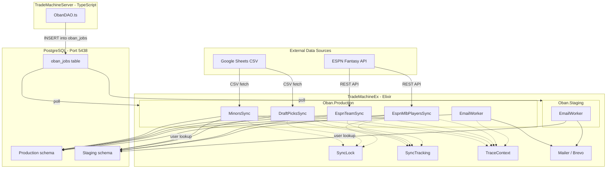

# Oban Job System

Human-focused reference for the TradeMachineEx background job system. For the agent-optimized quick-reference, see [AGENTS.md](../AGENTS.md).

## System Architecture

## Cron Job Timing (UTC)

```mermaid
gantt
    title Daily Cron Schedule (UTC)
    dateFormat HH:mm
    axisFormat %H:%M

    section Sync Jobs
    MinorsSync           :02:00, 15m
    DraftPicksSync       :03:00, 5m
    EspnTeamSync         :07:22, 5m
    EspnMlbPlayersSync   :07:32, 15m
```

| Job | Cron (production) | Queue | Max Attempts |
|---|---|---|---|
| Minor League Sync | `0 2 * * *` (2:00 AM) | `minors_sync` | 5 |
| Draft Picks Sync | `0 3 * * *` (3:00 AM) | `draft_sync` | 3 |
| ESPN Team Sync | `22 7 * * *` (7:22 AM) | `espn_sync` | 3 |
| ESPN MLB Players Sync | `32 7 * * *` (7:32 AM) | `espn_sync` | 3 |

In `dev.exs`, MinorsSync runs every 2 minutes and DraftPicksSync every 5 minutes for easy testing.

---

## Repos and Oban Instances

There are two PostgreSQL repos and two Oban instances, one per environment:

| Repo | DB Schema | Oban Instance | Queues |
|---|---|---|---|
| `TradeMachine.Repo.Production` | `public` (or `$PROD_SCHEMA`) | `Oban.Production` | `minors_sync`, `espn_sync`, `draft_sync`, `emails` |
| `TradeMachine.Repo.Staging` | `staging` (or `$STAGING_SCHEMA`) | `Oban.Staging` | `emails` only |

Cron jobs always run against **Production** only. The Staging Oban instance only processes emails enqueued by the TypeScript server when `APP_ENV=staging`.

---

## Job Details

### `MinorsSync` — `lib/trade_machine/jobs/minors_sync.ex`

Syncs minor league player ownership from a public Google Sheet to both databases.

**What it does:**
1. Fetches the Google Sheet as a CSV (`SheetFetcher`)
2. Parses the multi-team roster layout (`Parser`) — 9 columns per team, 5 teams per group
3. Matches parsed players to DB records by `meta.minorLeaguePlayerFromSheet` or name + league + MLB team
4. Updates matched players' `leagueTeamId`, inserts new ones, clears stale ownership

**Reads from:** `TradeMachine.Repo.Production` and `TradeMachine.Repo.Staging`
**Writes to:** `TradeMachine.Repo.Production` and `TradeMachine.Repo.Staging` (`player` table)
**External deps:** Google Sheets CSV export (via `Req`)
**Env vars:** `MINOR_LEAGUE_SHEET_ID`, `MINOR_LEAGUE_SHEET_GID` (default `"806978055"`)
**Concurrency guard:** `SyncLock` (`:minors_sync`) prevents overlapping runs
**Unique constraint:** Only one job allowed in `available/scheduled/executing/retryable` states at a time

---

### `DraftPicksSync` — `lib/trade_machine/jobs/draft_picks_sync.ex`

Syncs draft pick ownership from a public Google Sheet to both databases.

**What it does:**
1. Resolves the current season from the `draft_picks_season_thresholds` compile-time config (raises `RuntimeError` if config is outdated)
2. Fetches the Google Sheet as a CSV (`DraftPicks.SheetFetcher`)
3. Parses the multi-team layout (`DraftPicks.Parser`) — 7 columns per owner block, 5 owners per group, 4 groups, 15 picks per group (10 major + 1 HM + 4 LM)
4. For each non-cleared pick, resolves `original_owner_csv` and `current_owner_csv` to team IDs via `user.csvName`
5. Upserts each pick into the `draft_pick` table (keyed on `type + season + round + originalOwnerId`), updating `currentOwnerId` and `pick_number` on conflict

**Expected counts (when all picks active):** 200 majors + 20 HM + 80 LM = 300 total per repo. Cleared picks (OVR ≤ 0 or blank round) are skipped — this is normal after drafts.

**Season calculation:** Configured in `config/config.exs` as `draft_picks_season_thresholds` — a descending list of `{~D[yyyy-mm-dd], year}` pairs representing the **minor league season**. The first entry whose date is on or before today is used. Major league picks use `minor_season + 1` (their draft is held in spring of the following year). Update this list each year once the MLB season start date is confirmed.

**Reads from:** `TradeMachine.Repo.Production` and `TradeMachine.Repo.Staging`\
**Writes to:** `TradeMachine.Repo.Production` and `TradeMachine.Repo.Staging` (`draft_pick` table)\
**External deps:** Google Sheets CSV export (via `Req`)\
**Env vars:** `DRAFT_PICKS_SHEET_ID`, `DRAFT_PICKS_SHEET_GID` (default `"142978697"`)\
**Concurrency guard:** `SyncLock` (`:draft_picks_sync`) prevents overlapping runs\
**Unique constraint:** Only one job allowed in `available/scheduled/executing/retryable` states at a time

---

### `EspnTeamSync` — `lib/trade_machine/jobs/espn_team_sync.ex`

Syncs ESPN fantasy team metadata to both databases. Runs 10 minutes before `EspnMlbPlayersSync` so team data is fresh when players are synced.

**What it does:**
1. Fetches all league teams from the ESPN Fantasy API
2. Matches each ESPN team to a DB team by `espn_id`
3. Updates the `team.espnTeam` JSON column with ESPN data, and the `team.name` column.

**Reads from:** `TradeMachine.Repo.Production` and `TradeMachine.Repo.Staging`
**Writes to:** `TradeMachine.Repo.Production` and `TradeMachine.Repo.Staging` (`team` table)
**External deps:** ESPN Fantasy API (via `TradeMachine.ESPN.Client` / `Req`)
**Env vars:** `ESPN_SEASON_YEAR` (configures which season to fetch)

---

### `EspnMlbPlayersSync` — `lib/trade_machine/jobs/espn_mlb_players_sync.ex`

Syncs the full ESPN major league player pool to both databases. Runs after `EspnTeamSync`.

**What it does:**
1. Fetches all players from the ESPN Fantasy API (paginated)
2. Runs a multi-phase matching engine: update existing players, claim unclaimed ones, insert new
3. Syncs Production first, then Staging; triggers GC after to manage memory

**Reads from:** `TradeMachine.Repo.Production` and `TradeMachine.Repo.Staging`
**Writes to:** `TradeMachine.Repo.Production` and `TradeMachine.Repo.Staging` (`player` table)
**External deps:** ESPN Fantasy API (via `TradeMachine.ESPN.Client` / `Req`)
**Env vars:** `ESPN_SEASON_YEAR`
**Concurrency guard:** `SyncLock` (`:mlb_players_sync`) prevents overlapping runs
**Unique constraint:** Only one job allowed in `available/scheduled/executing/retryable` states at a time

---

### `EmailWorker` — `lib/trade_machine/jobs/email_worker.ex`

Sends transactional emails. Enqueued by the TypeScript server when a user registers or requests a password reset.

**What it does:**
1. Reads the `email_type` and `data` (user ID) from job args
2. Selects the repo based on `env` arg (`"production"` → Production repo, anything else → Staging)
3. Looks up the user and renders + sends the appropriate email via Brevo

**Supported email types:**

| `email_type` arg | Email sent |
|---|---|
| `"reset_password"` | Password reset link |
| `"registration"` or `"registration_email"` | Welcome / registration confirmation |
| `"test"` | Test email (dev use) |

> `"registration_email"` is the value sent by `ObanDAO.ts` in TradeMachineServer; `"registration"` is accepted as an alias for forward compatibility.

**Reads from:** `TradeMachine.Repo.Production` or `TradeMachine.Repo.Staging` (based on `env`)
**Writes to:** None
**External deps:** Brevo (SendInBlue) via Swoosh
**Enqueue args:** `{ "email_type": "...", "data": "<userId>", "env": "production"|"staging" }`

> **How jobs get enqueued:** The TypeScript server (`ObanDAO.ts`) inserts rows directly into the `oban_jobs` table via Prisma. The Elixir app picks them up from the `emails` queue. The `env` field tells the worker which database to use so the correct user record is found.

---

## Shared Job Infrastructure

| Module | Purpose |
|---|---|
| `TradeMachine.SyncLock` | In-memory lock (Agent-based) to prevent concurrent runs of the same sync job |
| `TradeMachine.SyncTracking` | Writes job execution metadata (start, complete, fail) to `SyncJobExecution` table |
| `TradeMachine.Tracing.TraceContext` | OpenTelemetry span management; propagates trace context from TypeScript server |
| `Oban.Plugins.Pruner` | Cleans up completed/discarded jobs after 48 hours (production) |
| `Oban.Plugins.Lifeline` | Rescues orphaned jobs that were executing when the node crashed |

---

## Cross-Service Integration

The TypeScript server enqueues jobs for the Elixir app by inserting rows directly into the `oban_jobs` table via Prisma (`TradeMachineServer/src/DAO/v2/ObanDAO.ts`). The Elixir app picks them up from the appropriate queue.

Trace context (W3C `traceparent` / `tracestate`) is propagated from the TypeScript server into job args, allowing end-to-end distributed tracing across the TypeScript request → Oban job boundary.
